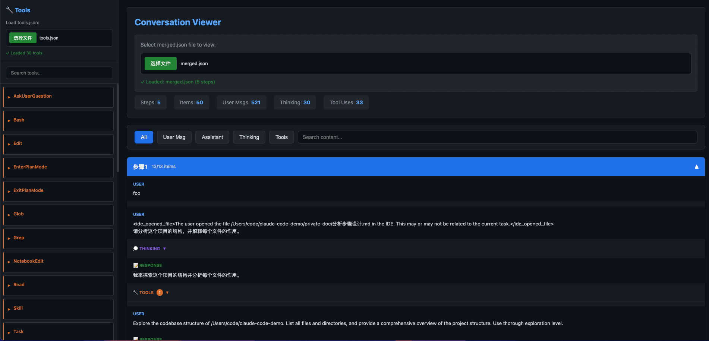

# Claude Code mitmproxy Viewer

一个用于**分析 Claude Code 系统提示词、推理过程与工具调用流程**的研究型项目。

本项目通过 **mitmproxy 抓包** Claude Code 的请求与响应数据，并将其整理成结构化的执行轨迹，方便分析：

* 系统提示词结构
* agent 决策逻辑
* 工具调用链
* 多轮交互流程
* 错误恢复与修复策略


---

## 项目目标

如果只是让 Claude Code 随便写几行代码，只能看到**局部提示词**。

为了真正理解其 agent 架构，需要设计一个**完整工作流测试场景**，触发：

* 读取代码
* 修改代码
* 创建文件
* 调用工具
* 多轮交互
* 出错后修复
* 运行测试

通过这些步骤，可以观察到：

> Claude Code 的完整系统提示词结构 + 工具调用策略 + 决策逻辑

---

## 项目结构

```
claude-code-mitmproxy-viewer/
│
├── 步骤1/
│   ├── *.txt        # 原始抓包（req/resp body）
│   ├── *.json       # 提取后的 content 数据
│
├── 步骤2/
├── 步骤3/
├── 步骤4/
├── 步骤5/
│
├── merged.json      # 所有步骤整合后的完整执行轨迹
├── tools.json       # 聚合的唯一工具列表（30+ 个工具）
│
├── process.py       # 数据处理脚本
├── analyze.py       # 工具调用分析脚本
│
├── viewer.html      # 可视化查看工具（左右分区：tools + conversation）
│
├── analysis.md      # 对话流程及工具调用分析报告
├── analysis.xlsx    # 对话流程及工具调用统计表格
├── 表格分析-prompt.txt  # 表格分析用的 prompt（可发给 agent 生成 analysis）
│
├── 分析步骤设计.md   # 测试场景与prompt设计（核心文档）
└── README.md
```

---

## 核心文件说明

### 分析步骤设计.md（核心文档）

定义了完整的测试场景与 prompt 设计，目的是触发 Claude Code 的完整 agent 工作流程。

包含：

* 多轮任务设计
* 工具调用触发
* 错误场景构造
* 自动修复流程

这是整个实验设计的理论基础。

---

### 步骤1～步骤5 文件夹

每个步骤对应一次测试阶段。

每个文件夹包含：

#### 原始抓包文件（*.txt）

从 mitmproxy 中复制出的：

* request body
* response body

用于保留完整原始记录。

---

#### 处理后 JSON（*.json）

从 request 中提取：

* content
* thinking
* tool_use

等核心字段，用于结构化分析。

---

### merged.json

整合所有步骤后的**完整 agent 执行轨迹**：

* 多轮对话
* thinking 内容
* 工具调用
* 子代理行为

这是最终分析用的主数据文件。

---

### tools.json

聚合所有步骤中使用的**唯一工具列表**（30+ 个工具）：

* 工具名称（name）
* 工具描述（description）
* 输入参数结构（input_schema）

通过 `process.py` 的 `aggregate_tools()` 函数自动生成，按工具名称去重。

---

### process.py

数据处理脚本，用于：

```
txt 抓包 → step json → merged.json + tools.json
```

主要功能：

* 解析 txt 抓包文件
* 提取 content、thinking、tool_use 字段
* 转换为结构化 JSON
* 合并所有步骤数据（生成 merged.json）
* 聚合唯一工具列表（生成 tools.json）

运行方式：

```bash
python process.py
# 选择操作 3 生成 tools.json
# 选择操作 2 生成 merged.json
# 选择操作 1 可根据步骤x下的reqx.txt文件解析成对应的reqx.json文件
```

---

### analyze.py
使用表格分析-prompt.txt中的prompt，可配合 agent 生成 analyze.py

工具调用分析脚本，用于：

* 统计工具调用次数
* 分析工具调用链
* 生成分析报告（analysis.md）
* 导出统计表格（analysis.xlsx）

---

### analysis.md / analysis.xlsx

工具调用分析结果，包含：

* 各工具调用次数统计
* 工具调用顺序分析
* 子代理调用关系
* 执行流程可视化

用于理解 Claude Code 的工具使用模式和决策逻辑。

---

### viewer.html

可视化查看工具，**左右分区设计**：

**左侧面板 - Tools:**
* 加载 tools.json
* 展示所有可用工具（默认闭合）
* 点击展开查看 description 和 input_schema
* 支持搜索过滤

**右侧面板 - Conversation:**
* 加载 merged.json
* 可视化 agent 执行轨迹
* 查看 thinking、text、tool_call
* 支持筛选和搜索

使用方式：

```
直接浏览器打开 viewer.html
```

---


## 使用流程

### 1. 安装 mitmproxy

官方文档：
[https://docs.mitmproxy.org/stable/overview/installation/](https://docs.mitmproxy.org/stable/overview/installation/)

macOS 推荐使用 Homebrew：

```bash
brew install --cask mitmproxy
```

---

### 2. 启动反向代理

以 GLM API 为例：

```bash
mitmweb --mode reverse:https://open.bigmodel.cn --listen-port 8125
```

启动后会自动打开控制台：

```
http://127.0.0.1:8081
```

可以查看：

* request headers
* request body
* response body

---

### 3. 修改 Claude Code API 地址

编辑配置文件：

```
~/claude/settings.json
```

将 API 地址改为本地代理：

```json
{
  "env": {
    "ANTHROPIC_BASE_URL": "http://127.0.0.1:8125/api/anthropic"
  }
}
```

---

### 4. 启动 Claude Code 并抓包

运行：

```bash
claude code
```

然后打开：

```
http://127.0.0.1:8081
```

即可在 mitmproxy 页面中看到所有请求与响应数据。

---

### 5. 保存抓包数据

将每一步的：

* request body
* response body

保存到对应步骤目录：

```
步骤1/
步骤2/
...
```

---

### 6. 处理数据

运行：

```bash
python process.py
```

选择操作：
* **1** - 转换 txt 文件为 JSON
* **2** - 合并所有步骤生成 `merged.json`
* **3** - 聚合工具列表生成 `tools.json`

---

### 7. 分析工具调用（可选）

运行：

```bash
python analyze.py
```

生成：
* `analysis.md` - 工具调用分析报告
* `analysis.xlsx` - 对话流程及工具调用统计表格

---

### 9. 可视化查看执行轨迹

直接打开：

```
viewer.html
```

即可查看完整 agent 执行过程。

---


## 研究用途

本项目适用于：

* Agent 架构研究
* 系统提示词逆向分析
* 工具调用策略研究
* 多轮推理流程分析
* LLM 工程实践

